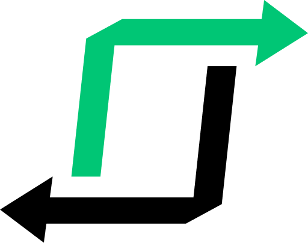

  

<h1 align="center">Factory Flow</h1>

  <a href="#tada-introduction">Introduction</a>&nbsp;&nbsp;&nbsp;|&nbsp;&nbsp;&nbsp;
  <a href="#hammer-documentation">Documentation</a>&nbsp;&nbsp;&nbsp;|&nbsp;&nbsp;&nbsp;
  <a href="#memo-license">License</a>

  

## :tada: Introduction

Factory Flow is a library designed to streamline the creation of automated robotic workflows. It is designed to be simple to use and to scale to any numbers of workflows.

 

## :hammer: Documentation

Visit [factory-flow.zelindro.dev](https://factory-flow.zelindro.dev/) to view the full documentation.

 

## :memo: License

This project is under the MIT license. See the [LICENSE](LICENSE.md) file for more details.