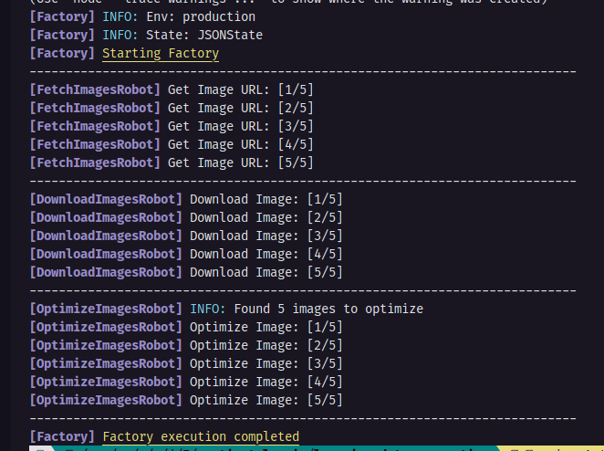
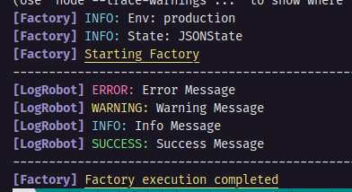

<h1 align="center">Factory Flow</h1>
<p align="center">A Library tool to execute expensives and scalable scripts like a real factory, with a state control and others features.</p>

<p align="center">
  <a href="#tada-introduction">Introduction</a>&nbsp;&nbsp;&nbsp;|&nbsp;&nbsp;&nbsp;
  <a href="#anchor-principles">Principles</a>&nbsp;&nbsp;&nbsp;|&nbsp;&nbsp;&nbsp;
  <a href="#hammer-usage">Usage</a>&nbsp;&nbsp;&nbsp;|&nbsp;&nbsp;&nbsp;
  <a href="#open_file_folder-more-features">More features</a>&nbsp;&nbsp;&nbsp;|&nbsp;&nbsp;&nbsp;
  <a href="#memo-license">License</a>
</p>

<p align="center">
  
</p>

<br />

## :tada: Introduction

Imagine a scenario where you need to run a script that goes through a image database, downloads them in a folder, checks their size and optimizes very heavy images.

Doing this script from the beginning can bring some challenges, such as the time it takes to execute each step of the process, or if an error occurs in the middle, you may need to run it from the beginning again.

<br />

<p align="center">
  
</p>

With this in mind, I developed this tool, thinking about two main principles.


## :anchor: Principles

### 1. Like a real factory process

The main idea of this tool is to simulate a `Robot Factory`, each `Robot` has its function, and as much as each `Robot` is one depends on the other, they just have access to the state, and perform their function by changing the state, and then giving way to the next `Robot`.

The `Robot` have no knowledge of the `Robot` that came before, nor of what came after, They don't communicate with each other.

<b>For example:</b>

the `Robot` that fetches the images data from the database, there is no need to have the function of downloading images, or optimizing them, each function will be used by a different `Robot`. The `Robot` that downloads the images only knows that it has a list of URLs in the state, and needs to download the images from that URL, while the one that optimizes, knows that there are images in a folder, and that it needs to optimize the heavy ones.

<br />

### 2. Keep the state updated

The state is the main object of the tool, it is the object that will be passed to each `Robot`, and it is the object that will be updated by each `Robot`.

The state needs to be loaded at the beginning, and updated with each update made, each `Robot` has the responsibility to check the state and avoid duplicate work.

Keeping the state updated, it is possible to temporarily remove a `Robot` from the process, to focus on developing another.

<b>For example:</b>

If the `Robot` that downloads the images has already downloaded the image, it will not download them again, it will only download the images that are not in the state.

<br />

## :hammer: Usage

### 1. Install the package

After starting a new node.js project, install the dependency using your preferred manager.

```sh
# Yarn
yarn add factory-flow

# NPM
npm install factory-flow

# PNPM
pnpm install factory-flow
```

Currently the package only works in "ES modules", so you need to set the `type` field in your `package.json` to `module`.

```json
{
  "type": "module"
}
```

The use of typescript is not mandatory but is highly recommended.

<br />

### 2. Create your robots

Create a folder to store your robots, and create a file for each robot, each robot must extend the `Robot` class, and implement the `execute` method.

<br />
<b>Robot to Fetch Images URL </b>

```ts
// robots/fetchImages.ts
import { Robot } from "factory-flow/core";

class FetchImagesRobot extends Robot {
  async execute(): Promise<void> {
    const images: string[] = [];
    // ... your code to get the images here
    this.state.set("images", images);
    // OR
    this.state.set("images", (oldImages) => {
      return [...oldImages, ...images];
    });
  }
}

export default FetchImagesRobot;
```

<br />
<b>Robot to download the images</b>

```ts
// robots/downloadImages.ts
import { Robot } from "factory-flow/core";

class DownloadImagesRobot extends Robot {
  async execute(): Promise<void> {
    const images: string[] = this.state.get("images");
    const alreadyDownloaded: string[] = this.state.get("downloaded") || [];

    for (const image of images) {
      if (alreadyDownloaded.includes(image)) {
        continue;
      }
      // ... your code to download the images here
      alreadyDownloaded.push(image);
      // Save the state after each download
      // to avoid downloading the same image again
      this.state.set("downloaded", alreadyDownloaded);
      await this.state.save();
    }
  }
}

export default DownloadImagesRobot;
```
<br />

### 3. Create the State Manager

Create a state for the factory, you can create it from scratch by extending the "FactoryState" class, or use a ready-made state in the library.

<br />

<b>Using a JSON file</b>

```ts
// state.ts
import { JSONState } from "factory-flow/core";

interface State {
  images: string[];
  downloaded: string[];
}

const initialState: State = {
  images: [],
  downloaded: [],
};

const __filename = fileURLToPath(import.meta.url);
const statePath = path.resolve(path.dirname(__filename), "state.json");

const state = new JSONState<State>(initialState, statePath);

export default state;
```

<br />

<b>Creating a custom state</b>

```ts
// state.ts
import { FactoryState } from "factory-flow/core";

interface State {
  images: string[];
  downloaded: string[];
}

class CustomState extends FactoryState<State> {
  constructor(initialState: State) {
    super(initialState);
  }

  public async initialize(): Promise<boolean> {
    // Your code to initialize the state
    // This is where you will load the state already saved at the beginning of the execution
    return true;
  }

  public async save() {
    // Your code to save the state
    // This is where you will save the state after each update
  }
}

const initialState: State = {
  images: [],
  downloaded: [],
};

const state = new CustomState(initialState);

export default state;
```

### 4. make your robots know the State

Pass the State Class as the first Generic when extending the Robot, now when you call `this.state` inside the robot, it will be typed with the state you passed.

```ts
// robots/fetchImages.ts
import CustomState from '../state';
import { Robot } from "factory-flow/core";

class FetchImagesRobot extends Robot<CustomState> {
  async execute(): Promise<void> {
    // return the type that was declared in the state, in this case, string[]
    const images = this.state.get("images");
    // ... your code to get the images here
    this.state.set("images", images);
  }
}

export default FetchImagesRobot;
```

### 5. Create and Execute the Factory Flow

- Create the factory flow, and add the robots to the factory, the factory will be responsible for executing the robots in the correct order.
- Here you can add as if they were blocks, and you can always remove or add a new `Robot` in any position.
- After adding the robots, the `.execute()` method must be called for the factory to begin the process.

```ts
// factory.ts
import { Factory } from "factory-flow/core";

import FetchImagesRobot from "./robots/fetchImages";
import DownloadImagesRobot from "./robots/downloadImages";
import state from "./state";

// Create and execute the factory flow
Factory.createFlow(state)
  .pipe(FetchImagesRobot)
  .pipe(DownloadImagesRobot)
  .execute();

// OR

async function runImageDownloadFactory() {
  const factory = await Factory
    .createFlow(state)
    .pipe(FetchImagesRobot)
    .pipe(DownloadImagesRobot)
    .execute();
  // You can access the state after the execution
  console.log(factory.state.get("downloaded"));
}

```

<br />

## :open_file_folder: More features

You can add extra functions to the flow, such as conditions and loops.

<b>Notice:</b>

- You need to be in the standard layer of the flow to be able to call `execute`, so every extra function that starts needs to be ended with `endif`, `while` or `catch` to return to the standard layer.
- You can add as many extra functions as you want, with several extra layers.
- You can add extra functions in any position in the flow, and you can always remove or add a new `Robot` in any position.

<br />

### Conditional flow

- You can create conditional flows, to do this, just use the `if` method, passing boolean or a function that returns a boolean, then all robots that were added below will only be executed if the condition is true.
- You can add an `else`, to then execute if the condition is false, and to return to the normal flow, just use `endif`.

```ts

Factory
  .createFlow(state)
    .if((factory) => factory.state.get("images").length > 0)
      .pipe(DownloadImagesRobot)
    .else()
      .pipe(FetchImagesRobot)
      .pipe(DownloadImagesRobot)
    .endif()
  .execute()

```

<br />

### Do-while loop flow

- You can create a loop flow, to do this, just use the `do` method, then all robots that were added below.
- To return to the normal flow, just use `while`, passing boolean or a function that returns a boolean.
- The loop it will only be executed as long as the condition remains `true`.

```ts

Factory
  .createFlow(state)
    .do()
      .pipe(FetchSingleImageRobot)
      .pipe(DownloadSingleImageRobot)
    .while((factory) => factory.state.get("remainingImages").length > 0)
  .execute()

```
<br />

### Try-Catch Flow

- You can create a try-catch flow, to catch any errors that happen during the flow, to do this, just use the `try` method, then all robots that were added below.
- To return to the normal flow, just use `catch`, passing a function that will be executed if an error occurs.

```ts

Factory
  .createFlow(state)
    .try()
      .pipe(FetchImagesRobot)
      .pipe(DownloadImagesRobot)
    .catch(async (error) => {
      console.error("Error fetching images", error);
      // You can also stop the flow calling throw again here
      // throw error;
    })
  .execute()

```

<br />

### Pass settings to robots

You can pass settings to the robots, to do this, just pass the settings as the second parameter in the `pipe` method as a object, the robot then receives, in constructor second parameter.


```ts
// In the Robot
import CustomState from '../state';

interface Settings {
  limit: number;
}

class FetchImagesRobot extends Robot<CustomState, Settings> {
  private limit: number;

  // The settings are passed as the second parameter
  constructor(factory: Factory, settings: Settings) {
    super(factory);
    this.limit = settings.limit;
  }

  async execute(): Promise<void> {
    // ... robot execution code here
  }
}

// In the Factory

Factory.createFlow(state)
  // Pass the settings as the second parameter
  .pipe(FetchImagesRobot, { limit: 10 })
  .execute();

```

<br />

### Stop the flow

You can stop the flow at any time, to do this, just call the `stop` method, the flow will be stopped.

```ts

Factory
  .createFlow(state)
    .if((factory) => factory.state.get("images").length > 0)
      .pipe(DownloadImagesRobot)
    .else()
      .pipe(FetchImagesRobot)
      // Stop the flow here
      .stop()
    .endif()
    // This robot will not be executed in the else condition 
    .pipe(ARemainingRobot)
  .execute()

```

<br />

### Make logs

You can make logs inside the robots, to do this, just call some method of the `log` module injected inside the robot.

```ts

class LogRobot extends Robot {
  async execute(): Promise<void> {
    this.log.error("Error Message");
    this.log.warning("Warning Message");
    this.log.info("Info Message");
    this.log.success("Success Message");
  }
}

```

<b>Result:</b>
<p align="center">
  
</p>

<br />

## :memo: License

This project is under the MIT license. See the [LICENSE](LICENSE.md) file for more details.